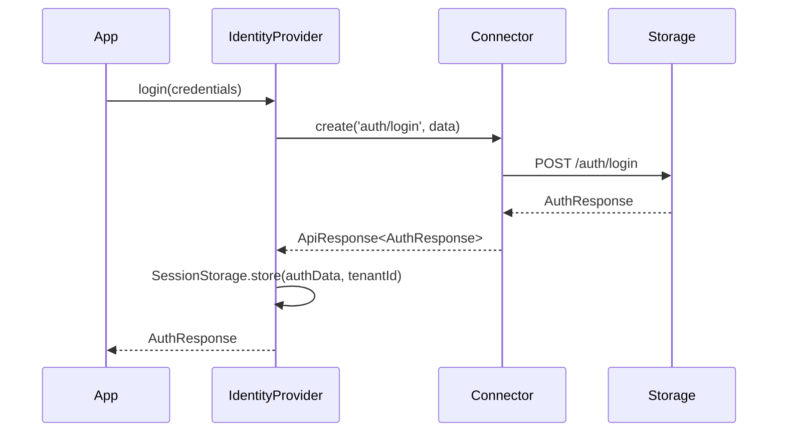
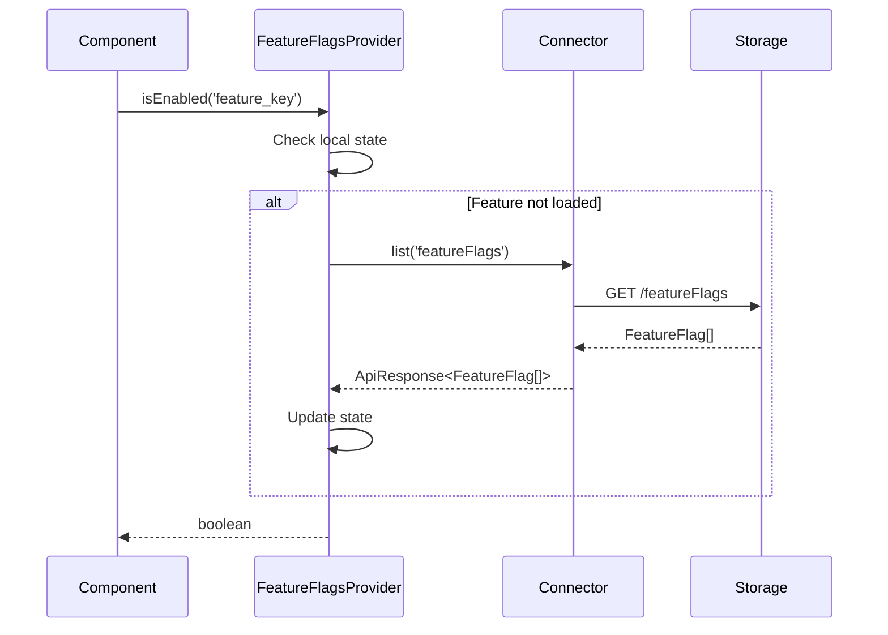
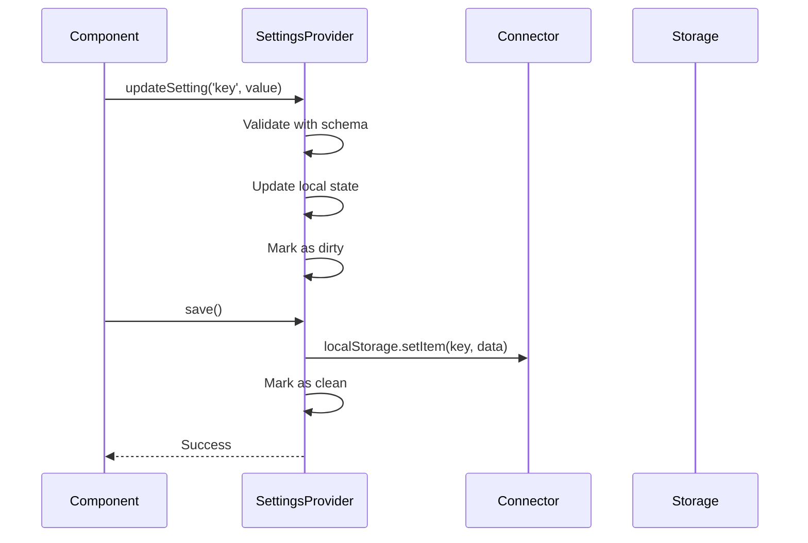

# Architecture

This document describes the internal architecture and design patterns of React Identity Access.

## System Overview

React Identity Access follows a layered provider architecture with clear separation of concerns:

```
┌─────────────────────────────────────────────────────────────┐
│                    Application Layer                        │
├─────────────────────────────────────────────────────────────┤
│  Components: FeatureFlag, SubscriptionGuard, RoleGuard     │
├─────────────────────────────────────────────────────────────┤
│  Hooks: useAuth, useFeatureFlags, useSettings, etc.        │
├─────────────────────────────────────────────────────────────┤
│                    Provider Layer                           │
│  ┌─────────────────────────────────────────────────────────┐ │
│  │ SettingsProvider (Configuration Management)             │ │
│  └─────────────────────────────────────────────────────────┘ │
│  ┌─────────────────────────────────────────────────────────┐ │
│  │ SubscriptionProvider (Billing & Plans)                 │ │
│  └─────────────────────────────────────────────────────────┘ │
│  ┌─────────────────────────────────────────────────────────┐ │
│  │ FeatureFlagsProvider (Feature Control)                 │ │
│  └─────────────────────────────────────────────────────────┘ │
│  ┌─────────────────────────────────────────────────────────┐ │
│  │ IdentityProvider (Authentication & Authorization)       │ │
│  └─────────────────────────────────────────────────────────┘ │
│  ┌─────────────────────────────────────────────────────────┐ │
│  │ TenantProvider (Multi-tenancy Resolution)              │ │
│  └─────────────────────────────────────────────────────────┘ │
│  ┌─────────────────────────────────────────────────────────┐ │
│  │ ConnectorProvider (Data Access Abstraction)            │ │
│  └─────────────────────────────────────────────────────────┘ │
├─────────────────────────────────────────────────────────────┤
│                    Data Layer                               │
│  ┌─────────────────┐  ┌─────────────────┐  ┌─────────────┐  │
│  │ LocalStorage    │  │ Fetch/REST API  │  │ Custom      │  │
│  │ Connector       │  │ Connector       │  │ Connector   │  │
│  └─────────────────┘  └─────────────────┘  └─────────────┘  │
├─────────────────────────────────────────────────────────────┤
│                    Storage Layer                            │
│  ┌─────────────────┐  ┌─────────────────┐  ┌─────────────┐  │
│  │ Browser         │  │ REST API        │  │ Database    │  │
│  │ localStorage    │  │ Backend         │  │ Custom      │  │
│  └─────────────────┘  └─────────────────┘  └─────────────┘  │
└─────────────────────────────────────────────────────────────┘
```

## Core Design Principles

### 1. Provider Composition
Each provider has a single responsibility and can be used independently:

```tsx
// Minimal setup - just authentication
<ConnectorProvider>
  <TenantProvider>
    <IdentityProvider>
      <App />
    </IdentityProvider>
  </TenantProvider>
</ConnectorProvider>

// Full setup - all features
<ConnectorProvider>
  <TenantProvider>
    <IdentityProvider>
      <FeatureFlagsProvider>
        <SubscriptionProvider>
          <SettingsProvider>
            <App />
          </SettingsProvider>
        </SubscriptionProvider>
      </FeatureFlagsProvider>
    </IdentityProvider>
  </TenantProvider>
</ConnectorProvider>
```

### 2. Connector Abstraction
Data access is abstracted through the connector pattern:

```typescript
interface BaseConnector {
  get<T>(path: string): Promise<ApiResponse<T>>;
  list<T>(path: string): Promise<ApiResponse<T[]>>;
  create<T>(path: string, data: any): Promise<ApiResponse<T>>;
  update<T>(path: string, id: string, updates: Partial<T>): Promise<ApiResponse<T>>;
  delete(path: string, id: string): Promise<ApiResponse<void>>;
}
```

### 3. Multi-Tenant Session Isolation
Sessions are stored per tenant using the pattern `auth_session_[tenantId]`:

```typescript
// Tenant A session
localStorage.getItem('auth_session_acme-corp')

// Tenant B session  
localStorage.getItem('auth_session_startup-inc')
```

### 4. Type Safety
Full TypeScript support with generic types:

```typescript
interface SettingsProvider<T> {
  values: T;
  updateSetting: <K extends keyof T>(key: K, value: T[K]) => void;
  schema: z.ZodSchema<T>;
}
```

## Provider Details

### ConnectorProvider
**Purpose**: Data access abstraction and configuration
**Dependencies**: None (root provider)
**Key Features**:
- Connector instance management
- Token interceptor registration
- Seed data fallback

```typescript
interface ConnectorConfig {
  type: 'localStorage' | 'fetch';
  appId: string;
  seedData?: SeedData;
  // Fetch-specific
  baseUrl?: string;
  apiKey?: string;
  timeout?: number;
}
```

### TenantProvider
**Purpose**: Multi-tenant resolution and context
**Dependencies**: ConnectorProvider
**Key Features**:
- Multiple resolution strategies (subdomain, query-param, static)
- Tenant validation
- Automatic tenant switching

```typescript
interface TenantConfig {
  strategy: 'subdomain' | 'query-param' | 'static';
  static?: { tenantId: string };
  fallback?: string;
}
```

### IdentityProvider
**Purpose**: Authentication and authorization
**Dependencies**: ConnectorProvider, TenantProvider
**Key Features**:
- Multi-tenant session management
- Token refresh and expiration
- Role-based access control
- Automatic logout on tenant mismatch

```typescript
interface AuthState {
  user: User | null;
  isAuthenticated: boolean;
  isLoading: boolean;
  error: string | null;
}
```

### FeatureFlagsProvider
**Purpose**: Dynamic feature control
**Dependencies**: ConnectorProvider, TenantProvider
**Key Features**:
- Tenant-specific feature flags
- Admin toggle capabilities
- Component-based feature gating

```typescript
interface FeatureFlag {
  id: string;
  key: string;
  name: string;
  description: string;
  defaultState: boolean;
  adminEditable: boolean;
}
```

### SubscriptionProvider
**Purpose**: Billing and subscription management
**Dependencies**: ConnectorProvider, TenantProvider
**Key Features**:
- Plan management
- Usage tracking
- Payment integration
- Subscription lifecycle

```typescript
interface Subscription {
  id: string;
  tenantId: string;
  planId: string;
  status: 'active' | 'canceled' | 'past_due';
  currentPeriodStart: Date;
  currentPeriodEnd: Date;
}
```

### SettingsProvider
**Purpose**: Configuration management
**Dependencies**: ConnectorProvider, TenantProvider
**Key Features**:
- Schema validation with Zod
- Nested setting updates
- Manual save mode
- Version control

```typescript
interface SettingsState<T> {
  values: T;
  isLoading: boolean;
  error: string | null;
  isDirty: boolean;
  lastSync: Date | null;
}
```

## Data Flow

### 1. Authentication Flow


### 2. Feature Flag Resolution


### 3. Settings Update Flow


## Error Handling

### Standardized Error Responses
```typescript
interface ApiResponse<T> {
  success: boolean;
  data?: T;
  error?: string;
  message?: string;
  metadata?: {
    total?: number;
    page?: number;
    limit?: number;
  };
}
```

### Error Boundaries
Each provider implements error boundaries:

```typescript
try {
  const result = await connector.get('path');
  if (!result.success) {
    dispatch({ type: 'ERROR', payload: result.error });
  }
} catch (error) {
  dispatch({ type: 'ERROR', payload: error.message });
}
```

## Performance Considerations

### 1. Memoization
Providers use React.useMemo for expensive computations:

```typescript
const tokenInterceptor = useMemo(() => ({
  getAccessToken: async () => { /* ... */ },
  refreshToken: async () => { /* ... */ },
  onTokenExpired: async () => { /* ... */ }
}), [connector, dispatch, tenantId]);
```

### 2. Lazy Loading
Data is loaded only when needed:

```typescript
useEffect(() => {
  if (tenantId && !state.loaded) {
    loadData();
  }
}, [tenantId, state.loaded]);
```

### 3. Optimistic Updates
UI updates immediately, with rollback on failure:

```typescript
// Optimistic update
dispatch({ type: 'UPDATE_SETTING', payload: { key, value } });

try {
  await connector.update(path, id, { [key]: value });
} catch (error) {
  // Rollback on failure
  dispatch({ type: 'REVERT_SETTING', payload: { key } });
}
```

## Security Considerations

### 1. Token Management
- Automatic token refresh
- Secure storage patterns
- Expiration handling

### 2. Tenant Isolation
- Session separation per tenant
- Data access validation
- Cross-tenant prevention

### 3. Permission Validation
- Role-based access control
- Component-level guards
- API-level authorization

## Extensibility

### Custom Connectors
Implement the BaseConnector interface:

```typescript
class CustomConnector extends BaseConnector {
  protected async getItem<T>(path: string): Promise<T | null> {
    // Custom implementation
  }
  
  protected async createItem<T>(path: string, data: any): Promise<T> {
    // Custom implementation
  }
  
  // ... other methods
}
```

### Custom Payment Gateways
Implement the PaymentGateway interface:

```typescript
class CustomPaymentGateway implements PaymentGateway {
  async createPayment(amount: number, currency: string): Promise<Payment> {
    // Custom implementation
  }
  
  async processPayment(paymentId: string): Promise<PaymentResult> {
    // Custom implementation
  }
}
```

### Plugin System
The architecture supports plugins through provider composition and custom hooks.
